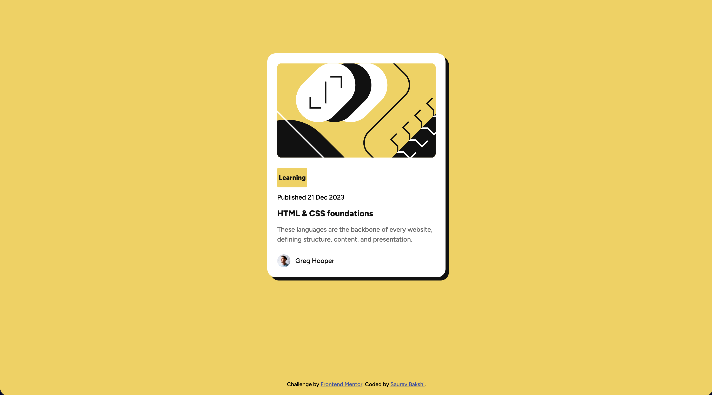

# Frontend Mentor - Blog preview card solution

This is a solution to the [Blog preview card challenge on Frontend Mentor](https://www.frontendmentor.io/challenges/blog-preview-card-ckPaj01IcS). Frontend Mentor challenges help you improve your coding skills by building realistic projects.

## Table of contents

- [Overview](#overview)
  - [The challenge](#the-challenge)
  - [Screenshot](#screenshot)
  - [Links](#links)
- [My process](#my-process)
  - [Built with](#built-with)
  - [What I learned](#what-i-learned)
  - [Continued development](#continued-development)
  - [Useful resources](#useful-resources)
  - [AI Collaboration](#ai-collaboration)
- [Author](#author)

## Overview

### The challenge

Users should be able to:

- See hover and focus states for all interactive elements on the page

### Screenshot



### Links

- Solution URL: https://github.com/Prince15130/fm-blog-preview-card
- Live Site URL:  https://prince15130.github.io/fm-blog-preview-card/

## My process

### Built with

- Semantic HTML5 markup
- CSS custom properties
- Flexbox
- Mobile-first workflow

### What I learned

Working on this project helped me understand:

**Semantic HTML:** Using proper elements like `<article>`, `<main>`, `<time>`, and heading hierarchy (`<h2>`) for better accessibility and SEO.

```html
<article class="card">
  <section class="info">
    <time datetime="2023-12-21">Published 21 Dec 2023</time>
    <h2><a href="#">HTML & CSS foundations</a></h2>
  </section>
</article>
```

**CSS Custom Properties:** Creating reusable variables for colors and typography makes the code more maintainable.

```css
:root {
  --color-yellow: hsl(47, 88%, 63%);
  --color-gray-950: hsl(0, 0%, 7%);
  --font-family: "Figtree", sans-serif;
}
```

**Responsive Design:** Using `max-width` instead of fixed `width` ensures the card adapts to different screen sizes.

```css
.card {
  max-width: 24rem;
  width: 100%;
}
```

### Continued development

Areas I want to focus on in future projects:

- CSS Grid for more complex layouts
- CSS animations and transitions
- Accessibility testing with screen readers

### Useful resources

- [MDN Web Docs](https://developer.mozilla.org/) - Great reference for HTML and CSS properties.
- [CSS-Tricks Flexbox Guide](https://css-tricks.com/snippets/css/a-guide-to-flexbox/) - Helpful visual guide for understanding Flexbox.

### AI Collaboration

I used **GitHub Copilot** during this project for:

- Setting up CSS custom properties based on the style guide
- Code review for accessibility, semantic HTML, and responsive design
- Getting guidance on best practices (like using `rel="noopener noreferrer"` for external links)

The AI was helpful for catching issues I might have missed, like using `<header>` instead of `<h2>` for the article title, and suggesting `max-width` for better responsiveness.

## Author

- Frontend Mentor - [@Prince15130](https://www.frontendmentor.io/profile/Prince15130)
- GitHub - [Saurav Bakshi](https://github.com/prince1530)
